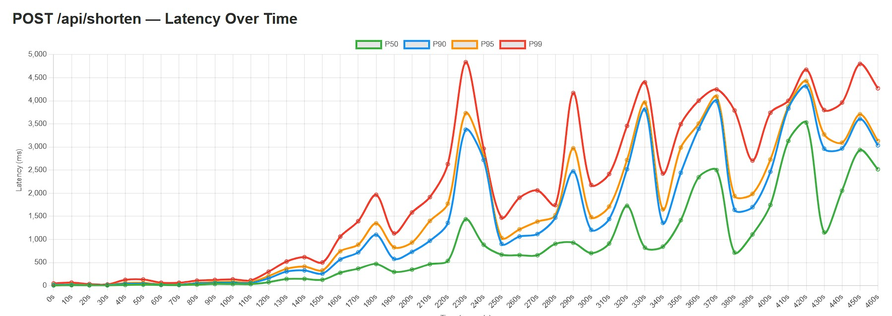
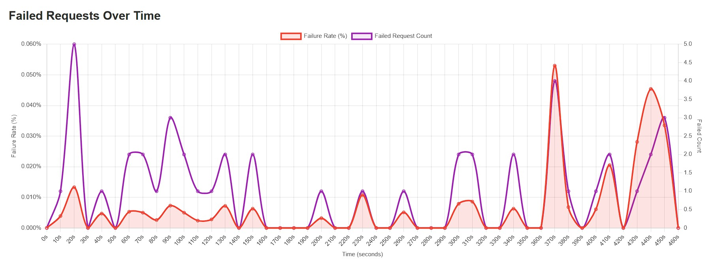

# Running URL Shortener Locally

## Prerequisites

Make sure you have the following installed:

| Tool | Version | Download |
|---|---|---|
| Java JDK | 21+ | [adoptium.net](https://adoptium.net) |
| Maven | 3.8+ | [maven.apache.org](https://maven.apache.org/download.cgi) |
| PostgreSQL | Any | [postgresql.org](https://www.postgresql.org/download/windows/) |

Verify your installations by running these in Command Prompt:

```bash
java -version
mvn -version
psql --version
```

---

## 1. Clone or download the project

If using Git:

```bash
git clone https://github.com/your-username/url-shortener.git
cd url-shortener
```

Or just extract the downloaded zip and open the folder.

---

## 2. Set up the database

Open Command Prompt and connect to PostgreSQL:

```bash
psql -U postgres
```

The table already exists in the `postgres` database (default). Verify:

```sql
select count(*) from url_shortener;
```

Type `\q` to exit psql.

---

## 3. Configure application properties

Open `src/main/resources/application.properties` and set your PostgreSQL password:

```properties
spring.datasource.url=jdbc:postgresql://localhost:5432/postgres
spring.datasource.username=postgres
spring.datasource.password=YOUR_PASSWORD_HERE

spring.jpa.hibernate.ddl-auto=update
spring.jpa.show-sql=true
```

Replace `YOUR_PASSWORD_HERE` with the password you set during PostgreSQL installation.

---

## 4. Build the project

In the project root folder, run:

```bash
mvn clean install -DskipTests
```

This downloads all dependencies and compiles the code. First run takes a few minutes.

---

## 5. Run the application

```bash
mvn spring-boot:run
```

You should see this in the output when it starts successfully:

```
Tomcat initialized with port 8080 (http)
Started UrlShortenerApplication in X.XXX seconds
```

The app is now running at `http://localhost:8080`

---

## 6. Test the endpoints

### Create a short URL

```bash
curl --location 'localhost:8080/api/shorten' \
--header 'Content-Type: application/json' \
--data '{
    "originalUrl":"https://maheshdeshmukh.netlify.app/index.html"
}'
```

### Redirect using a short code

```bash
curl --location 'localhost:8080/api/redirect?shortCode=be2edb862e'
```

---

## 7. Run tests

```bash
mvn test
```

---

## Common errors

| Error | Cause | Fix |
|---|---|---|
| `Failed to configure a DataSource` | `application.properties` missing or empty | Add DB config as shown in step 3 |
| `database "url_shortener" does not exist` | Wrong DB name in JDBC URL | Use `postgres` as the DB name in the URL |
| `duplicate key value violates unique constraint` | Hibernate sequence out of sync | Change `@GeneratedValue` to `GenerationType.IDENTITY` |
| `Port 8080 already in use` | Another app using port 8080 | Add `server.port=8081` to `application.properties` |
| `Connection refused` | PostgreSQL not running | Start PostgreSQL service from Windows Services |

---

## Stopping the app

Press `Ctrl + C` in the terminal where the app is running.

---

## Load Testing

The project includes a k6-based load testing setup that ramps concurrent users from 50 → 2500 and measures latency percentiles (P50, P90, P95, P99) and failure rates.

### Prerequisites

Install k6 and Node.js:

```bash
winget install k6
winget install OpenJS.NodeJS
```

Verify installation:

```bash
k6 version
node --version
```

### Tune Spring Boot for stress testing

Add the following to `src/main/resources/application.properties` so the app isn't the bottleneck:

```properties
# Tomcat
server.tomcat.threads.max=1000
server.tomcat.threads.min-spare=50
server.tomcat.accept-count=500

# HikariCP
spring.datasource.hikari.maximum-pool-size=1000
spring.datasource.hikari.minimum-idle=20
spring.datasource.hikari.connection-timeout=30000
```

Restart Spring Boot after making these changes.

### Project structure

```
k6/
├── package.json             # npm scripts
├── scripts/
│   ├── stress-test.js       # the k6 test definition
│   └── run-test.js          # orchestrator (runs k6 + generates HTML report)
└── results/
    ├── json/                # raw k6 output (timestamped)
    └── html/                # generated reports (timestamped)
```

### Run a load test

From the `k6/` directory:

```bash
cd k6
npm run stress
```

This single command:
1. Runs the k6 stress test with ramped stages from 50 to 2500 VUs
2. Saves the JSON output to `k6/results/json/stress-<timestamp>.json`
3. Generates an HTML report at `k6/results/html/stress-<timestamp>.html`
4. Opens the report automatically in your browser

The npm script is defined in `k6/package.json`:

```json
{
  "scripts": {
    "stress": "node scripts/run-test.js"
  }
}
```

### Reading the results

The HTML report contains three line charts:

#### 1. Latency Over Time (POST /api/shorten)

Shows P50, P90, P95, and P99 response times in milliseconds for the create endpoint.



**What to look for:**
- Flat lines at low VUs = system is healthy
- Lines diverging upwards = queues building up
- P99 jumping disproportionately = tail latency degradation
- The point where the curve goes vertical = your breaking point

#### 2. Latency Over Time (GET /api/redirect)

Same percentiles but for the redirect endpoint. Usually faster than shorten since it's a simple lookup.

#### 3. Failed Requests Over Time

Shows both failure **rate (%)** on the left Y-axis and raw **failure count** on the right Y-axis. The dual-axis lets you see tiny failure rates that would otherwise appear flat at 0%.



**What to look for:**
- Stays at 0% as long as the system can handle the load
- Sharp upward jumps indicate timeouts or connection refusals
- Even a 0.4% failure rate is significant at scale

### Understanding the metrics

| Metric | What it means |
|---|---|
| **P50** | Median — half your users see this latency or better |
| **P90** | 90% of users see this latency or better |
| **P95** | 95% of users — typical SLA target |
| **P99** | 99% of users — tail latency, hardest to optimize |
| **Failure Rate** | Percentage of requests that returned 4xx/5xx or timed out |

### Monitoring during a test

Open psql in a separate window and run during the test to see DB connection usage:

```sql
SELECT
  count(*) FILTER (WHERE state = 'active') AS active,
  count(*) FILTER (WHERE state = 'idle')   AS idle,
  count(*)                                 AS total
FROM pg_stat_activity
WHERE application_name = 'PostgreSQL JDBC Driver';
```

If `active` stays close to your HikariCP `maximum-pool-size`, you're hitting DB concurrency limits.

### Adjusting the load profile

Edit `k6/scripts/stress-test.js` to change the load stages:

```javascript
stages: [
  { duration: '10s', target: 50   },
  { duration: '30s', target: 50   },
  { duration: '10s', target: 100  },
  { duration: '30s', target: 100  },
  // ... add or remove stages as needed
],
```

Each stage has a `duration` and `target` (number of concurrent virtual users).